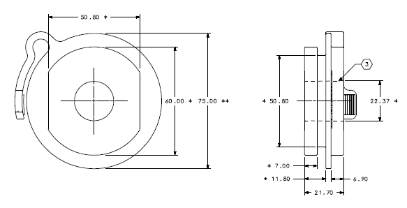
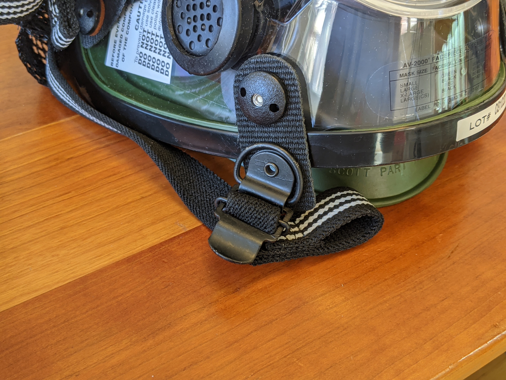
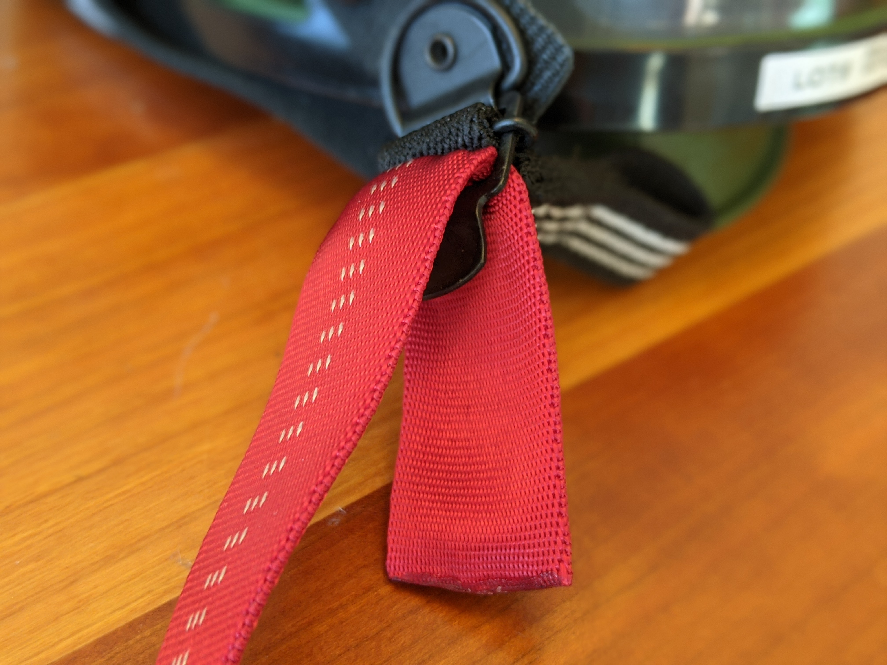
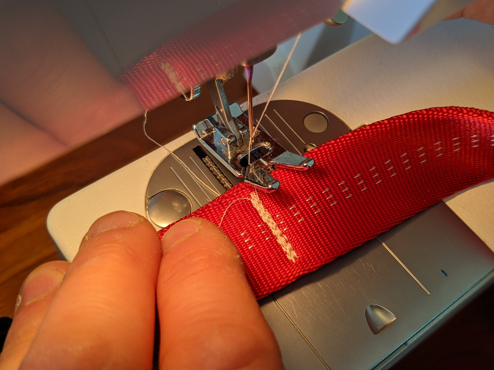

November 27, 2020

# Suspension of Marketing and Sales of the Aerosol-Reducing-Mask (ARM)

Effective November 27 (2020), the ARM team is suspending any sales or distribution of the current version of the ARM.

Review of clinical trial data that became available to the team on November 26  shows that the ARM device is not as effective at reducing leak and aerosolization as earlier data had suggested. The [preliminary data and analysis report](https://github.com/GliaX/Aerosol-Reducing-Mask/blob/master/reports/20201210%20Clinical%20Trial%20Summary%20Leak%20Data.md) is posted to the repository.

The clinical trial was not a requirement for regulatory approval from Health Canada and the device is still approved under an Interim Order. However the trial data suggests that while safe and effective at providing respiratory support, the device fails to meets its primary indication (protection of health care providers and other patients from infectious aerosols), we are withholding all sales and deployments of the device.

We are currently undertaking a detailed analysis of the device and causes of failure in order to create a road map for required modifications for a subsequent version. Such modifications and the necessary testing will likely not be completed in sufficient time to meet current urgent needs. All analysis reports and other documents will continue to be posted on the public repository.

# Aerosol Reducing Mask for Non-Invasive Ventilation

## Purpose
The Minimizing Aerosolization In Non-invasive (MAIN) Ventilation COVID-19 mask
is a sealed, filtered, full-face mask minimizing virus aerosolization and
enabling the use of Non-Invasive Positive Pressure Ventilation (NIPPV) machines
for patients with COVID-19, or similar symptoms.  The mask adaptor is the
primary connection between the sealed facemask and standard medical 22mm
respiratory tubing, fittings and filters. An additive manufacturing method, also
known as 3D printing, was used to produce the mask adapter because of its
relative speed to make objects of complicated geometries and availability. Due
to the medical nature of the adapter, certain specifications must be followed in
its production to prevent any infectious transmission from the patient to health
care workers and other patients.

## Bill Of Materials
 * [3M Scott AV-2000 Facepiece](https://www.3mscott.com/products/av-2000-facepiece/)
 * 3M Gasket seal
 * 3D printed adapter (ABS)
 * Safety release strap, 25mm width x 35cm length[[MEC](https://www.mec.ca/en/product/5020-829/1%22%2825mm%29-Nylon-Tubular-Climbing-Webbing)]

## Adaptor 3D Printing Specifications and Parameters

 * Adapter Version: v1.0
 * Filament Material: ABS
 * Printer Nozzle: 0.4mm
 * Infill Percentage & Pattern: 100% Infill, Rectilinear infill
 * Wall thickness: 2.0mm (5 wall/perimeters with 0.4mm nozzle)
 * Top and bottom thickness: 2.0mm (5 top and bottom layers at 0.2mm layer height)
 * Supports: Required
 * Raft: Not preferred; Printing on the bed creates a smoother finish
 * Orientation: Mask face on the bed, Outer face upwards (See Figure 1)

Additional Slicer Settings:
 * Use ‘random start points for all perimeters’ (Cura)
 * Use ‘Connect infill lines’ (Cura)
 * Use ‘Random start points for all perimeters’ (Simply3D)

*Figure 1: Orientation of Adapter v1.0 on Print Bed*

* NOTE: ABS is prone to thermoplastic contraction (shrinkage). If the slicing
software does not already compensate for this shrinkage, consider measuring the
product to ensure the correct scale. Amount of contraction can vary between
different brands of ABS – printing calibration tools and test-prints recommended
to determine exact percentage to scale.

## Post-Print Check Guidelines
Ensure the following:
 * Inside diameter of female port on outward face should measure between 22.37
 +0.1/-0.15mm on outside face (see Figure 2). Use of digital calipers strongly
 recommended.
 * Note tolerances for other dimensions post printing (also see Figure 2).
 * Layers adhere properly to each other
 * Walls are completely fused together
 * Surfaces (outer and inner) are smooth without gaps, burrs, blobs
 * The print has decent flexibility (i.e. latch)

*Figure 2: Critical part dimensions*

# Print Traceability Guidelines

For each batch printed, the following items must be logged:
 * Material used
 * Lot number of material used
 * Colour of material
 * Date of print
 * Machines used for print
 
# Attaching safety release
 
 * Insert strap into bottom right buckle of helmet - Patient should be able to pull strap with right hand.
 * Loop strap back approximately 6 cm.
 * Sew firmly using 3 runs across the area to sew.
 

 
*Figure 3: Front view of helmet*
 

*Figure 4: Strap inserted into buckle*

 
*Figure 5: Completed sewn strap*
